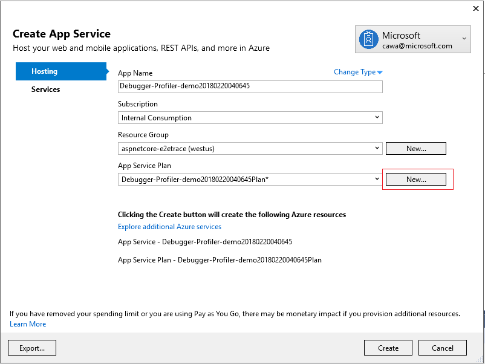
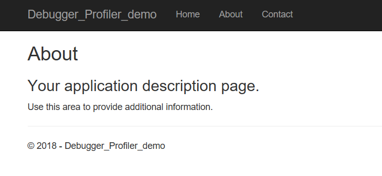
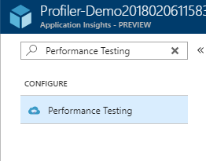

# Application Insights Profiler and Snapshot Debugger Sample Demo Web Application

## Overview
This walkthrough demonstrates you can easily use [Application Insights](https://azure.microsoft.com/services/application-insights/) to performance code-level diagnostics in your application when your web site experiences runtime exceptions or slow performance.
There are two parts in the walkthrough introducing two features of Application Insights:

* [Application Insights Snapshot Debugger](https://docs.microsoft.com/azure/application-insights/app-insights-snapshot-debugger)

* [Application Insights Profiler](https://docs.microsoft.com/en-us/azure/application-insights/app-insights-profiler)

For the purpose of showing how onboarding works, this walkthrough uses a very simple ASP.NET core web app that simulates runtime exceptions and performance issues using simple logics and APIs. The technology though would work in for more sophisticated apps and hosting envrionments.

## Pre-requisites
* [Visual Studio 2017](https://www.visualstudio.com/)
    * Install ASP.NET and Web Development
    * To experience the full feature for Snapshot Debugging, you will need Visual Studio 2017 Enterprise. Check Snapshot Debugger in the Optional component list if you are installing Visual Studio Enterprise SKU
* This tutorial showcases features in [Application Insights](https://azure.microsoft.com/en-us/services/application-insights/). Please proceed if you are open to use Application Insights for monitoring your application.
* Clone or download this repository
    * Open *Debugger-Profiler-Demo / Debugger-Profiler-Demo.csproj* file

## Part 1: Application Insights Snapshot Debugger

### What is Application Insights Snapshot Debugger
Snapshot Debugger automatically takes a snapshot to record the state of your running application when an exception happens. You can view information such as local variable values from the snapshot.

Snapshot collection is available for:
* .NET Framework and ASP.NET applications running .NET Framework 4.5 or later.
* .NET Core 2.0 and ASP.NET Core 2.0 applications running on Windows.

Enabling snapshot debugger requires:
1. Installing a NuGet package in your web app. The sample already includes it for convenience purpose

    ```
    Microsoft.ApplicationInsights.SnapshotCollector
    ```
2. Add some code in your application to track exceptions. The Startup.cs file already includes the code changes needed. If you use ASP.NET 4.5 or later, please refer to [Debug snapshots on exceptions in .NET apps](https://docs.microsoft.com/en-us/azure/application-insights/app-insights-snapshot-debugger) on how to track exceptions in your code.

    ```csharp
    using Microsoft.ApplicationInsights.SnapshotCollector;
    using Microsoft.Extensions.Options;
    ...
class Startup
{
    private class SnapshotCollectorTelemetryProcessorFactory : ITelemetryProcessorFactory
    {
        private readonly IServiceProvider _serviceProvider;

        public SnapshotCollectorTelemetryProcessorFactory(IServiceProvider serviceProvider) =>
            _serviceProvider = serviceProvider;

        public ITelemetryProcessor Create(ITelemetryProcessor next)
        {
            var snapshotConfigurationOptions = _serviceProvider.GetService<IOptions<SnapshotCollectorConfiguration>>();
            return new SnapshotCollectorTelemetryProcessor(next, configuration: snapshotConfigurationOptions.Value);
        }
    }

    public Startup(IConfiguration configuration) => Configuration = configuration;

    public IConfiguration Configuration { get; }

    // This method gets called by the runtime. Use this method to add services to the container.
    public void ConfigureServices(IServiceCollection services)
    {
        // Configure SnapshotCollector from application settings
        services.Configure<SnapshotCollectorConfiguration>(Configuration.GetSection(nameof(SnapshotCollectorConfiguration)));

        // Add SnapshotCollector telemetry processor.
        services.AddSingleton<ITelemetryProcessorFactory>(sp => new SnapshotCollectorTelemetryProcessorFactory(sp));

        // TODO: Add other services your application needs here.
    }
}
    ```

### Deploy the sample to Azure
* Right click on **Profiler-Demo** project, select **Publish ... **



* Without changing the default **Micrsoft Azure App Service** and **Create New**, click **Publish** button
* For App Service Plan, click **New** button and select **Size** dropdown in the **Configure App Service Plan** dialog. Please choose **Basic** size tier or higher, and make sure the **RAM** is at least **3.5GB**. Click **OK** and exit this dialog


* Proceed with Publish


### Add Application Insights to the App Services
* Navigate to [Azure Portal](https://portal.azure.com)
* Go to your App Services Web App resource that hosts your Web Application
* on the left hand side navigation menu, search *Application Insights* and select **Application Insights** under Monitoring


* If you accept default option **Create new resource**, click **OK** button and follow instructions on the orange banner to restart your web Application

### Identify the root cause of runtime exceptions using Snapshot Debugger
Let's generate some exceptions in your web app to simulate when your app throws an exception in production environment.
This sample already includes the code that generate exceptions. All we have to do is to hit the web page where the exception is thrown.
* Navigate to your web app. Click on **Contact** tab


* Refresh the page a few times to make sure snapshots are captured - the first time exception will not have snapshot because App Insights does not know about the exception type yet to request for a snapshot.
* Wait for a few minutes for Exceptions to propagate to Application insights resource and for Snapshots to be uploaded
* Go to App Insights resource you created earlier. It should be in the same resource group as your Web App resource
* Go to Failures blade, click on **Exceptions** tab. Click **Exception** button under **Take action**


 

 * In **Select a sample exception** the exception description should say *Index was outside the bounds of the array*. Click into one of them
 * You will see **Open debug snapshot** above Exceptions on the right side of the blade. Click that


* You will see a blade saying **You don't have access**. This is because we made it a requirement for viewing snapshot to require a special permission, since the debug snapshot may contain sensitive information in local variables. Add yourself the permissions by click the button **Add Application Insights Snapshot Debugger Role**


* Now you can see the Call Stack and Local variables of your application when an exception is thrown


* For a more advanced experience, click on **Download Snapshot** to open snapshot in Visual Studio. The download might take a few seconds. Grab some snacks while waiting :-)

* Double-click on the downloaded .diagsession file to open in Visual Studio. If prompted, click **Yes** to trust the source


* Click **Debug with Managed** among the debugging options. You will see how the exception was thrown in the code.


## Part 2: Application Insights Profiler

### What is Application Insights Profiler
Application Insights Profiler is a ETW based technology that collects performance information from your web app running process, analyzes the traces and integrates with Azure so Profiler traces are available for a request captured by App Insights. If you used PerfView before, Profiler provides very similar experience.

###  Identify the code that slowed down your application using Profiler
Assuming you have deployed the web app to Azure. If not, please follow instructions from Part 1 to deploy and enable Application Insights.

This sample already includes the code that slows down the response time to some particular web request. Let's generate some traffic load to simulate user load in this application.

* Navigate to your web app. Click **About** tab. It takes around 10 seconds to load because the code is slowing it down.



* Copy the URL of this webpage

* Go to **Performance Testing** in your Application Insights resource



* Create a new Manual Test using the URL you copied earlier. Set the test duration to 5 minutes.

* Once the test starts running, go to Performance blade to enable Profiler
    * Note: it is very important to start running the load test first, then enable the profiler to view a profiler trace immediately. Profiler captures a trace immediately after enabled, then it follows the sampling algorithm for 2 minutes per hour to capture traces with minimal impact on the application performance


* Go to **Performance Testing** to make sure your test finished running

* Go to **Performance Blade**. Click on *GET HOME/About*. Click on **Profiler Traces** under **Take action**


* Use the Trace Viewer to identify which lines in your application code slowed down the app.


## Send Feedback
Please fill out this survey and let us know your experience trying this feature. We appreciate your feedback a lot!
